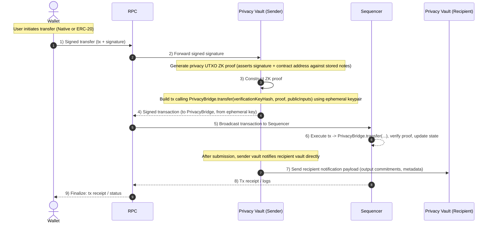

---
metaLinks:
  alternates:
    - https://app.gitbook.com/s/yE16Xb3IemPxJWydtPOj/basics/editor
---

# Private Transfers

There are two ways to perform private transfers on Payy:

1. Directly calling the [PrivacyBridge](../protocol/privacybridge.md) with the ZK proof authorising transfer of funds
2. Transparent upgrade using [Privacy Vault](../protocol/privacy-vault.md) (no wallet changes required)

### Transparent upgrade using Privacy Vault

Private payments (ERC-20 and native tokens) are transparently upgraded using the RPC and [Privacy Vault](../protocol/privacy-vault.md), so existing wallets need no modification. Wallets can continue to call ERC-20 `transfer(address,uint256)` (or construct a native transfer) using `eth_submitRawTransaction()` without any awareness of the privacy orchestration happening underneath. When the RPC detects a transfer (i.e. transaction selector is `0xa9059cbb`), it requests a ZK proof from the [Privacy Vault](../protocol/privacy-vault.md). The ZK proof generated by the Privacy Vault validates the transfer signature and constructs the relevant transaction proof to be submitted to the [PrivacyBridge](../protocol/privacybridge.md).

As the transaction data is private, the receiving party needs to receive the [Note](../protocol/privacy-layer/utxo.md) data for the transaction in order to access funds. The Privacy Vault uses the [`PrivacyVaultRegistry`](../protocol/privacyvaultregistry.md) to determine where to send the funds for a specific address, and receives signed confirmation from the receiver's Privacy Vault once it has been sent.

<figure><figcaption></figcaption></figure>

The following describes the process flow:

* Wallet signs a native or ERC-20 transfer and sends it to the RPC.
* RPC forwards the signed transfer signature to the sender’s Privacy Vault.

* Privacy Vault validates and generates a UTXO-style ZK proof asserting:
  * The user’s transfer signature.

  * The target contract/address.
  * Consistency with existing stored notes.

  * Privacy Vault constructs a transaction calling `PrivacyBridge.transfer(verificationKeyHash, proof, publicInputs)` using an ephemeral keypair.
* Privacy Vault returns the signed transaction (to PrivacyBridge) to the RPC.
* RPC forwards the transaction to the Sequencer.
* Sequencer executes the transaction, verifying the proof and updating the privacy pool state.
* Sender’s Privacy Vault notifies the recipient’s Privacy Vault with the transaction metadata (e.g., output commitments) for note detection and syncing.
* RPC returns the transaction receipt/logs to the Wallet.

