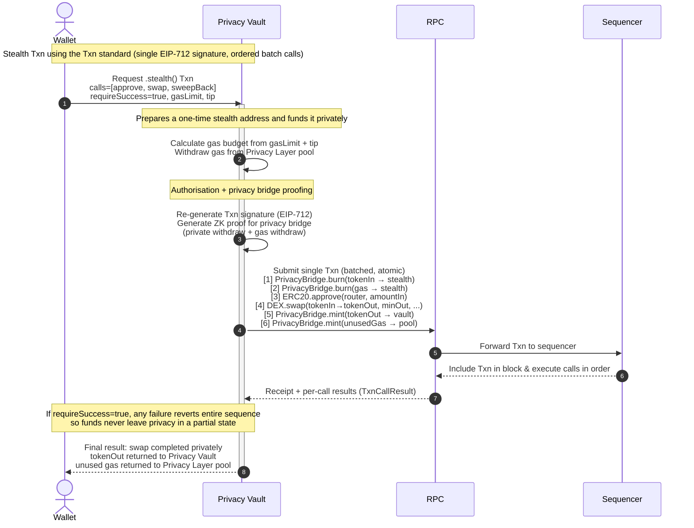

# Stealth Transactions

Payy enables privacy on the [EVM Layer](../protocol/evm-layer.md) by making it seamless to move funds in and out of the [Privacy Layer](../protocol/privacy-layer/) (native ERC-20 privacy pools), using a newly minted one-time stealth address for each transaction. For example, to perform a private swap from [PUSD](../stablecoins/pusd.md) to PAYY, private funds are pulled from the Privacy Layer to a new one-time address, the swap is performed on the [EVM Layer](../protocol/evm-layer.md) and PAYY tokens are returned to the Privacy Layer pool after the swap completes.

<figure><figcaption></figcaption></figure>


Moving funds in and out of the Privacy Layer [requires zero gas](../stablecoins/zero-fee-payments.md), so Stealth Transactions do not incur additional gas over normal EVM transactions.


The following diagram describes the flow:


See [Payy Transactions > Stealth](../build-on-payy/payy-transactions/stealth.md) for a guide on using Stealth Transactions.


### Gas fees

Moving funds in and out of the Privacy Layer [requires no gas](../stablecoins/zero-fee-payments.md), but stealth transactions themselves require gas for the one-time address that will be responsible for the transaction. The Privacy Vault automatically withdraws gas from the Privacy Layer based on gas limit and gas fee tip, any unused gas is returned to the Privacy Layer when the transaction completes.

