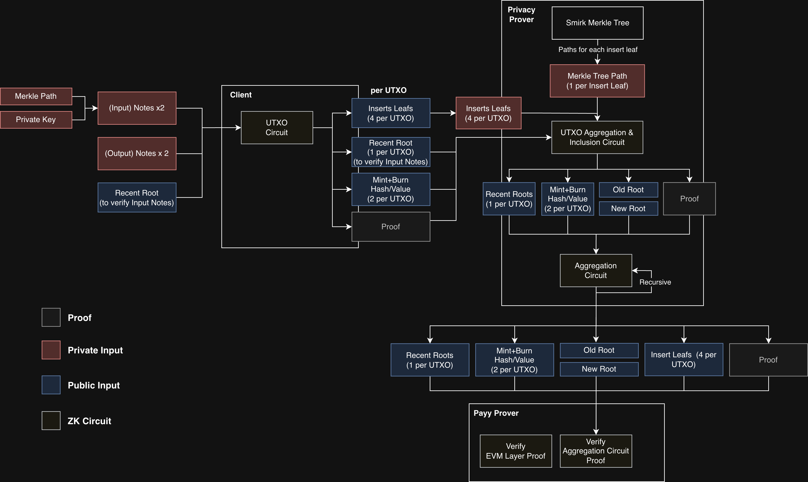

# ZK Circuits

There are three privacy ZK circuits:

1. [**Utxo proof**](https://github.com/polybase/payy/tree/next/noir/utxo) (client/Privacy Vault) - runs on the client or [Privacy Vault](../privacy-vault.md) and proves that a user has permission to spend an input note and generate an output note.
2. [**Utxo aggregation and inclusion proof**](https://github.com/polybase/payy/tree/next/noir/agg_utxo) (prover) - aggregates Utxo proofs and verifies the new merkle root state
3. [**Aggregation proof**](https://github.com/polybase/payy/tree/next/noir/agg_agg) (prover) - aggregates Utxo aggregation and inclusion proofs recursively to the required depth to include all Utxo proofs from a single block

The privacy aggregation proof is then combined with the EVM Layer ZK verifier proof, ready for rollup submission to Ethereum.



The following diagram shows the ZK circuits used by the Privacy Layer:

<figure><figcaption></figcaption></figure>
