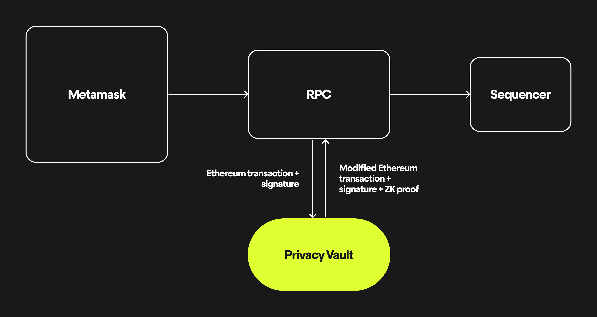

# Privacy Vault

The Privacy Vault is a key component of Payy that enables privacy whilst maintaining compatibility with existing Ethereum infrastructure.


The Privacy Vault is an optional component. Users can directly call the PrivacyBridge to submit private transfers and transactions, but the Privacy Vault ensures compatibility with existing Ethereum wallets.


The Privacy Vault has three responsibilities:

1. Storing private data - private data cannot be stored onchain
2. ZK proving transactions - converts the private data and signed transactions into ZK proofs that can be used without revealing the underlying data
3. Data sharing - if you need to share data for compliance reasons, you can authorise others to access your data (this will always be opt-in - no data will be shared without your consent)

You can configure your Privacy Vault by adding the `vault` parameter to your RPC URL. The vault has minimal system requirements, so can be run on micro commodity hardware.

```
https://rpc.payy.link?vault=102.10.0.69
```

When you send a transaction to the RPC, the RPC checks if it needs to generate a proof to bridge your funds into the EVM layer or send a direct payment. The ZK proof ensures that the protocol rules are followed but hides the private data.

<figure><figcaption></figcaption></figure>

If a private storage layer is configured, RPC requests to the node will use both the public and private data to respond to requests. That means, a user with both a public and private balance would see their full balance, whereas other external users would only see the public balance.

